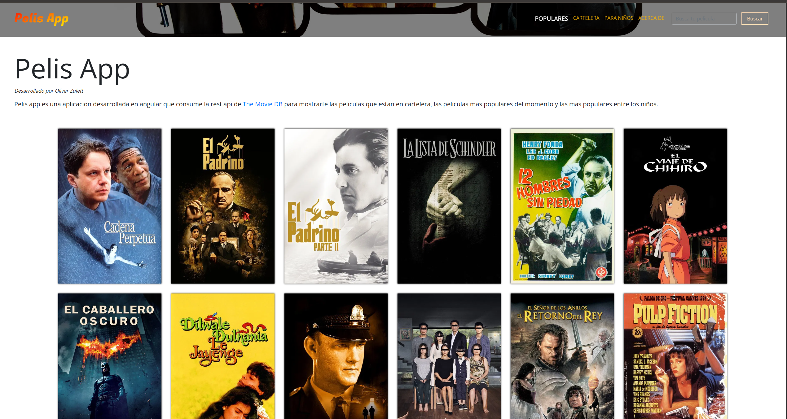

# 🎬 Pelis App

<div align="center">

**Aplicación web para explorar películas, construida con Angular 21 y la API de The Movie Database.**

Descubre las películas más populares, las que están en cartelera, contenido para niños y mucho más.

</div>

---

## 📸 Captura de pantalla

<div align="center">



</div>

---

## ✨ Características

- 🏆 **Películas Populares** — Explora las películas mejor valoradas de todos los tiempos (rating ≥ 8.0 y más de 2000 votos).
- 🎥 **Cartelera** — Consulta las películas que se están proyectando actualmente en cines.
- 👶 **Para Niños** — Sección dedicada con películas certificadas para todo público (clasificación G).
- 🔍 **Buscador** — Busca películas por nombre directamente desde la barra de navegación.
- 🎞️ **Detalle de Película** — Visualiza información completa: sinopsis, géneros, presupuesto, ingresos, fecha de estreno, duración y más.
- 📚 **Colecciones** — Si una película pertenece a una saga, se muestran las demás películas de la colección.
- 📄 **Paginación** — Navegación paginada para recorrer grandes catálogos de películas con facilidad.
- 🌐 **Contenido en Español** — Toda la información de películas se muestra en español (es-ES).
- 🎨 **Animaciones** — Transiciones y efectos visuales con Animate.css y CSS personalizado.
- 📱 **Responsive** — Diseño adaptable a dispositivos móviles, tablets y escritorio.

---

## 🏗️ Arquitectura del proyecto

```
src/app/
├── components/           # Componentes reutilizables
│   ├── footer/           # Pie de página
│   ├── loading/          # Indicador de carga animado
│   ├── movie-background/ # Imagen de fondo dinámica
│   ├── movie-card/       # Tarjeta de película con hover
│   ├── movie-list/       # Lista paginada de películas
│   └── navbar/           # Barra de navegación con buscador
├── interfaces/           # Interfaces TypeScript para tipado
│   ├── movie.response.ts
│   ├── movies.response.ts
│   ├── collection.response.ts
│   └── pagination.ts
├── pages/                # Páginas/vistas de la aplicación
│   ├── home/             # Página principal (populares)
│   ├── in-theatres/      # Cartelera
│   ├── for-kids/         # Películas para niños
│   ├── movie/            # Detalle de una película
│   └── about/            # Acerca de la app
├── pipes/                # Pipes personalizados
│   └── truncate-text.pipe.ts
├── providers/            # Servicios
│   ├── base.service.ts   # Servicio HTTP base con autenticación
│   ├── movies-v2.service.ts # Servicio principal de películas
│   └── tools.service.ts  # Utilidades (paginación, backgrounds)
└── app-routing.module.ts # Configuración de rutas
```

---

## 🚀 Instalación y ejecución

### Pre-requisitos

Asegúrate de tener instalado:

- [Node.js](https://nodejs.org/) v20.x (LTS) — puedes utilizar [nvm](https://github.com/nvm-sh/nvm) con el archivo `.nvmrc` incluido
- [Angular CLI](https://angular.dev/tools/cli) v21.x
- Una **API Key** de [The Movie Database (TMDb)](https://www.themoviedb.org/settings/api)

### 1. Clonar el repositorio

```bash
git clone https://github.com/OliverZulett/Pelis-App.git
cd Pelis-App
```

### 2. Instalar dependencias

```bash
npm install
```

### 3. Configurar variables de entorno

La aplicación necesita un **API Key (Bearer Token)** de TMDb para funcionar. Crea el archivo de entorno:

```bash
# Crea el archivo src/environments/environment.ts
```

```typescript
// src/environments/environment.ts
export const environment = {
  production: false,
  api_key: "TU_API_READ_ACCESS_TOKEN_AQUI",
  api_url: "https://api.themoviedb.org/3",
};
```

> 💡 **Nota:** El `api_key` corresponde al **API Read Access Token (Bearer)** de TMDb, no a la API Key simple. Puedes obtenerlo en [themoviedb.org/settings/api](https://www.themoviedb.org/settings/api).

### 4. Ejecutar en modo desarrollo

```bash
npm start
```

La aplicación estará disponible en **http://localhost:4200** 🚀

---

## 🌍 Despliegue

### Netlify

El proyecto incluye un archivo `netlify.toml` preconfigurado. Para el despliegue en producción, configura las siguientes **variables de entorno** en Netlify:

| Variable  | Descripción                                                  |
| --------- | ------------------------------------------------------------ |
| `API_KEY` | API Read Access Token (Bearer) de TMDb                       |
| `API_URL` | URL base de la API (default: `https://api.themoviedb.org/3`) |

El script `scripts/set-env.js` se encarga de inyectar las variables de entorno en el archivo `environment.ts` durante el build de producción.

```bash
# Build de producción (usado por Netlify)
npm run build:prod
```

---

## 📁 Scripts disponibles

| Comando              | Descripción                                            |
| -------------------- | ------------------------------------------------------ |
| `npm start`          | Inicia el servidor de desarrollo en `localhost:4200`   |
| `npm run build`      | Compila la aplicación (modo desarrollo)                |
| `npm run build:prod` | Genera el build de producción con variables de entorno |
| `npm test`           | Ejecuta las pruebas unitarias con Karma                |
| `npm run lint`       | Ejecuta el linter de TypeScript                        |
| `npm run e2e`        | Ejecuta las pruebas end-to-end con Protractor          |

---

## 🗺️ Rutas de la aplicación

| Ruta           | Componente            | Descripción                                |
| -------------- | --------------------- | ------------------------------------------ |
| `/home`        | `HomeComponent`       | Películas más populares (página principal) |
| `/in-theatres` | `InTheatresComponent` | Películas en cartelera actualmente         |
| `/for-kids`    | `ForKidsComponent`    | Películas aptas para niños                 |
| `/movie/:id`   | `MovieComponent`      | Detalle completo de una película           |
| `/about`       | `AboutComponent`      | Información sobre la aplicación            |

---

## 📡 API

Esta aplicación consume la **API v3 de The Movie Database (TMDb)**. Los endpoints principales utilizados son:

- `GET /movie/now_playing` — Películas en cartelera
- `GET /discover/movie` — Descubrimiento con filtros (populares, para niños)
- `GET /movie/{id}` — Detalle de una película
- `GET /collection/{id}` — Colección/saga de películas
- `GET /search/movie` — Búsqueda de películas por nombre

Para más información consulta la [documentación oficial de TMDb](https://developer.themoviedb.org/docs/getting-started).

---

## ✒️ Autor

<div align="center">

Desarrollado con ❤️ por **Oliver Zulett**

[](https://github.com/OliverZulett)

</div>

---

## 📄 Licencia

Este proyecto está bajo la licencia **MIT**. Consulta el archivo [LICENSE](LICENSE) para más detalles.

---

<div align="center">

⭐ Si te gusta este proyecto, ¡no olvides darle una estrella en GitHub!

</div>
